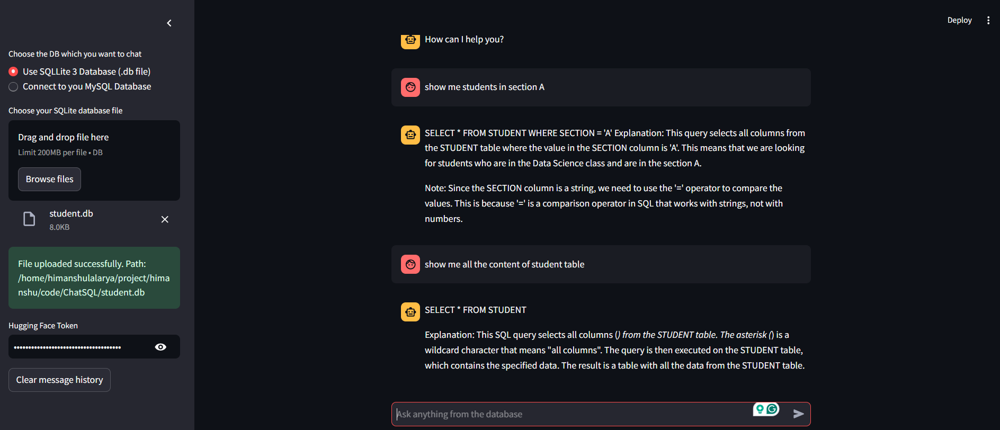

# LangChain: ChatSQL

This application allows you to interact with your database (SQLite or MySQL) using natural language queries. Built with LangChain and Hugging Face models, it processes user queries and generates SQL commands to fetch the required data from the database. 

## Features:
- **Chat Interface**: Ask questions in natural language about your database, and the system will generate corresponding SQL queries to fetch the data.
- **Supports SQLite and MySQL**: Connect to either SQLite (via `.db` file upload) or MySQL database.
- **Customizable**: Set your Hugging Face token for model inference and interact with the database.

## Requirements:
- Python 3.x
- Streamlit
- LangChain
- Hugging Face token
- SQLite or MySQL database

## Installation:
1. Clone the repository:
    ```bash
    git clone https://github.com/OriginalHybrid/ChatSQL.git
    cd your-repository-url
    ```
2. Install the dependencies:
    ```bash
    pip install -r requirements.txt
    ```
3. Start the Streamlit app:
    ```bash
    streamlit run app.py
    ```

## Usage:

1. **Choose Database**: 
   - Select either `SQLite` or `MySQL` from the sidebar.
   - For SQLite, upload a `.db` file.
   - For MySQL, enter the required connection details (host, username, password, and database).

2. **Enter Hugging Face Token**: 
   - Input your Hugging Face token to enable LLM model integration.

3. **Chat**:
   - Ask any question related to your database (e.g., "What is the total sales for January?").
   - The application will process the query, generate the SQL query, and show the results.

## Screenshot:


## Notes:
- Ensure the provided database is accessible and correctly formatted for queries.
- The application currently supports only basic SQL queries.

## Troubleshooting:
- **Error connecting to MySQL**: Double-check MySQL connection details.
- **Issue with SQLite file upload**: Ensure the `.db` file is valid and properly uploaded.

## License:
This project is licensed under the MIT License.

